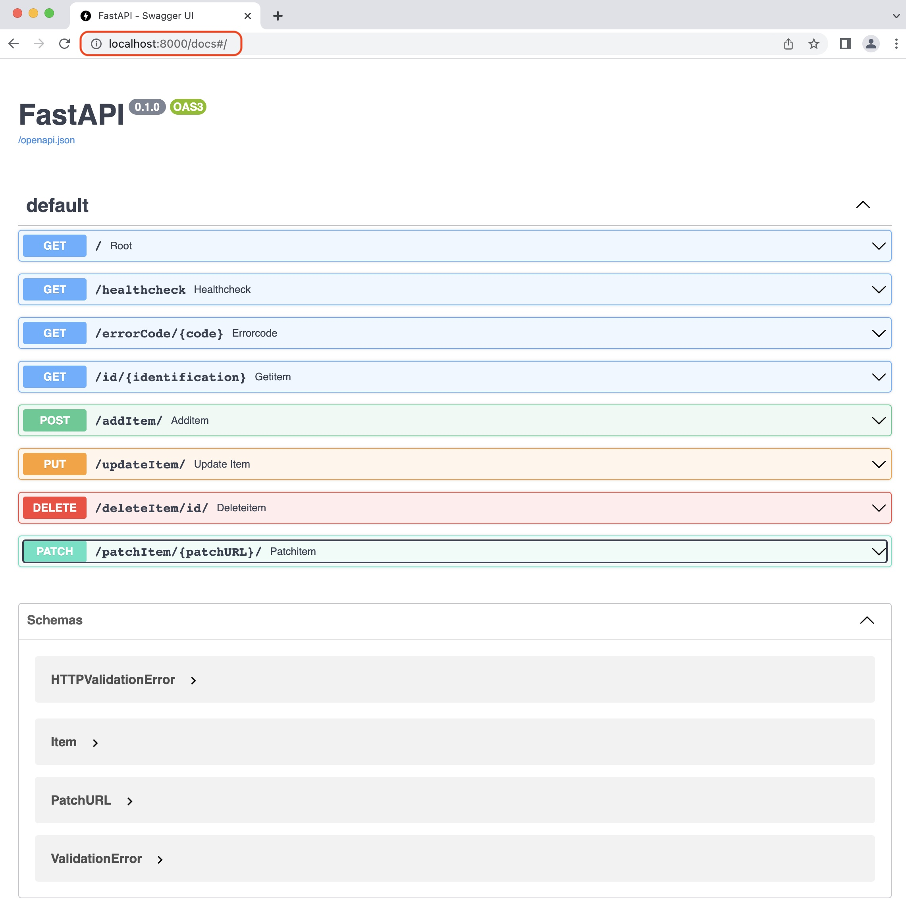

<!-- Improved compatibility of back to top link: See: https://github.com/othneildrew/Best-README-Template/pull/73 -->
<a name="readme-top"></a>

# What is FakeAPI

FakeAPI is a Python script that implements most of the REST API methods. It's not meant to be used in production but rather as a tutorial. The script does almost no verifications to keep the code small. I build it to learn more about the concept of REST API and also to test some API Gateways, load balancer and reverse proxy. The data is saved in a Redis database.

FakeAPI is based on:
* [FastAPI](https://fastapi.tiangolo.com/) framework
* [Uvicorn](https://www.uvicorn.org/) as the [ASGI](https://asgi.readthedocs.io/en/latest/) web server
* [Pydantic](https://docs.pydantic.dev/) for data validation
* [Redis](https://redis.io) for database

>FakeAPI implements only `JSON` objects and requires **Python 3.10+**

Take a look at the file `requirement.txt` for the Python modules required:

REST API methods implemented in FakeAPI are:
* **HTTP GET** to retrieve information
* **HTTP POST** to create a new resource
* **HTTP PUT** to make a complete update (all fields), if the item doesn't exists it is NOT added
* **HTTP DELETE** to delete a resource
* **HTTP PATCH** to make a partial update (only one field)
* **HTTP TRACE** server reply with the header received in the body of the 

# How to use this image
## Clone the project
Start by cloning the project using `gh`.
Use the command to clone the project on your local drive:
```sh
gh repo clone ddella/FakeAPI
```

The prefered method to clone the project is with `gh` but if you can't use it, use `cURL` to download it to your local drive and unzip it:
```sh
curl -L -o fakeapi.zip https://github.com/ddella/FakeAPI/archive/refs/heads/main.zip
unzip fakeapi.zip
cd FakeAPI-main
```
<p align="right">(<a href="#readme-top">back to top</a>)</p>

## Build the Docker image
You need to build the Docker image to run containers. No matter the method used to start the containers. Whether you use the `docker` command line or a `yaml` file to start a container, the Docker image is the same.

This is the `Dockerfile` needed to build the image:
```Dockerfile
# Use the following command to build the Docker image:
#   docker build -t fakeapi:2.0 .
# (Optional) If you suspect somethings wrong, you can start the container with the command:
#   docker run -it --rm --name fakeapi fakeapi:2.0 /bin/sh
#
FROM python:3.11-alpine3.17

# set the working directory for the app
RUN ["mkdir", "-p", "/usr/src/app"]
WORKDIR /usr/src/app

# copy the scripts to the folder
COPY src/ .

# install dependencies
RUN ["pip3", "install", "fastapi", "uvicorn", "pydantic", "pydantic[email]", "passlib", "PyJWT", "redis"]
# RUN ["pip3", "install", "-r", "requirements.txt"]

# start the FakeAPI server
CMD [ "python3", "./main.py" ]
```

Use this command to build the Docker image:
```sh
docker build -t fakeapi:2.0 .
```

>The final image should be `~90Mb`.

Use this command to check that the image is on your local repo:
```sh
docker image ls fakeapi:2.0
```

>Make sure you have the file `.dockerignore` in the same directory as the `Dockerfile`. This is to exclude files unneeded in the final image:

<p align="right">(<a href="#readme-top">back to top</a>)</p>

# Run the project
The FakeAPI project is meant to run as Docker containers. You will need at least one FakeAPI container and a Redis container. Below are three (3) different ways to start the containers. You will need at least one FakeAPI server and one Redis server.

If you don't have a Docker Swarm, my prefered way is with **Docker Compose**. It will start a FakeAPI and a Redis container with one small command.

1. Shows how to run the containers, FakeAPI and Redis, with the `docker run` command [standalone](docker.md)
2. Shows how to run the containers, FakeAPI and Redis, with `docker compose` and a `yaml` file [Docker Compose](docker-compose.md)
3. Shows how to run the containers, FakeAPI and Redis, as a Stack in a Docker Swarm [Docker Swarm Stack](docker-compose-stack.md)

## Docs URLs
You can check the swagger documentation made available at `http://localhost:8000/docs`. This will list all the methods with it's associated endpoints.

>**Notes:** Use either `HTTP` or `HTTPS` depending if you supply a certificate and private key when starting the FakeAPI container.

<p align="right">(<a href="#readme-top">back to top</a>)</p>



# let's get our hands dirty
The best way to test the FakeAPI is with [cURL](https://curl.se/). Look at the swagger documentation at `http://localhost:8000/docs`. A cURL example is included, in the source code, with every function. 

## Example with GET method
Use this command to query all the objects in the database:

```sh
curl -H "Content-type: application/json" \
-H "Accept: application/json" \
-i -L "http://localhost:8000/api/keys"
```
This will send a `GET` request to the server and it will return all the keys in the database:

    HTTP/1.1 200 OK
    date: Sun, 02 Apr 2023 12:15:40 GMT
    server: uvicorn
    content-length: 39
    content-type: application/json

    {"dbsize":1,"keys":["visited:server1"]}

<p align="right">(<a href="#readme-top">back to top</a>)</p>

## Development (Optionnal)
**If you goal is only to run the containers, skip this section**

If you want to play with the source code, you can read the following tutorial to setup a Python virtual development environment

* [development](venv.md)

## License
Distributed under the MIT License. See [LICENSE](LICENSE) for more information.
<p align="right">(<a href="#readme-top">back to top</a>)</p>

## Contact
Daniel Della-Noce - [Linkedin](https://www.linkedin.com/in/daniel-della-noce-2176b622/) - daniel@isociel.com

Project Link: [https://github.com/ddella/FakeAPI](https://github.com/ddella/FakeAPI)
<p align="right">(<a href="#readme-top">back to top</a>)</p>

## Acknowledgments
* [Official documentation of FastAPI](https://fastapi.tiangolo.com/)
* [Official documentation of Pydantic](https://docs.pydantic.dev/)
* [Official documentation of Uvicorn](https://www.uvicorn.org/)
* [REST API status code](https://restfulapi.net/http-status-codes/)
* [REST API method](https://restfulapi.net/http-methods/)
* [cURL utility](https://curl.se/)
* [Best README.md Template](https://github.com/othneildrew/Best-README-Template/pull/73)

<p align="right">(<a href="#readme-top">back to top</a>)</p>
