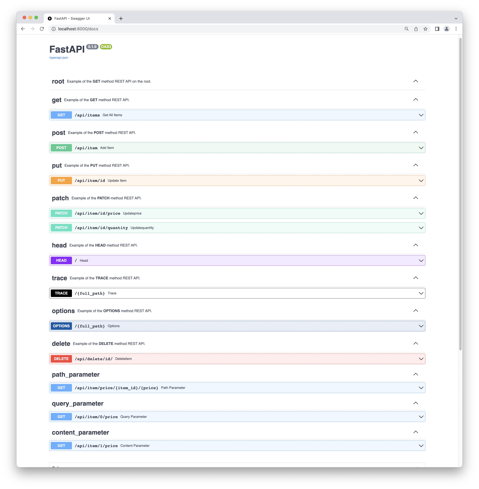

<!-- Improved compatibility of back to top link: See: https://github.com/othneildrew/Best-README-Template/pull/73 -->
<a name="readme-top"></a>

# What is FakeAPI

FakeAPI is a Python script that implements most of the REST API methods. Do not use it in a production deployment. The script does almost no testing, to keep the code small. I build it to learn more about the concept of REST API and also to test some API Gateways, like [Nginx API Gateway](https://www.nginx.com/learn/api-gateway/) and [MuleSoft](https://www.mulesoft.com/), to name a few.

>FaekAPI implements only `JSON` objects. Sorry no `XML` 😉

The script requires the following Python modules:
* pydantic
* uvicorn
* fastapi

REST API methods implemented in FakeAPI:
* **HTTP GET** to retrieve information
* **HTTP POST** to create a new resource
* **HTTP PUT** to Update/Replace a resource
* **HTTP DELETE** to delete a resource
* **HTTP PATCH** to make a Partial Update/Modify
* **HTTP TRACE** server reply with the header received

# How to use this image
## This is for educationnal **only**!

## Build the image with the Dockerfile in your Python app project
This is my `Dockerfile`:
```Dockerfile
# Build
# docker build -t fakeapi .
FROM python:alpine

RUN ["mkdir", "-p", "/usr/src/data"]
WORKDIR /usr/src/app

COPY ["./src/requirements.txt", "./"]
RUN ["pip", "install", "--no-cache-dir", "-r", "requirements.txt"]

COPY ["./src/*", "./"]

CMD [ "python", "./app.py" ]
```

After the build, the imaage should be `~78Mb`.

```sh
docker build -t fakeapi .
```
<p align="right">(<a href="#readme-top">back to top</a>)</p>

# Run the project
You can run the container with the database inside it. As soon as you exit the container, the data will be lost. You can map (`bind`) a local directory of the host inside the container. This way you keep the data after the container exit.

>Use an appropriate `hostname` if you start multiple containers. This is the only unique ID I found, as the process ID is alway `1` when the script runs inside the container. The logs will print the `hostname` so you know which container did what. Remember I made this script to test API Gateways.

## Run the project with the data file inside the container.
The data will be lost when the container exits.
```sh
docker run -it --rm -p 9443:9443 --name server1 \
--network=backend \
--ip 172.31.11.10 \
--env HOST='172.31.11.11' \
--env PORT=9443 \
--env SERVER_CRT=/etc/ssl/private/server1-crt.pem \
--env SERVER_KEY=/etc/ssl/private/server1-key.pem \
--env DATA=/usr/src/data/data.json \
--hostname server1 fakeapi
```
>If you prefer Docker Compose, see [FakeAPI YAML](FakeAPI_YAML.md)

## Custom network (optional)
FakeAPI runs on a custom Docker network. This workshop is not about Docker custom network but I encourage you to run your containers in custom networks to get the added value of a DNS server. The following command was used to create the `backend` network.

```sh
docker network create --driver=bridge --subnet=172.31.11.0/24 --ip-range=172.31.11.128/25 --gateway=172.31.11.1 backend
```
<p align="right">(<a href="#readme-top">back to top</a>)</p>

## Run the project with the data file on the Docker host.
Mount the container `/usr/src/data` directory on the current directory of the host. Data will be on the Docker host when the container exits. The container also run in interactive mode because of the `-it` switch. This way you can look at the logs.
```sh
docker run -it --rm -p 9443:9443 --name fakeapi \
--network=backend \
--ip 172.31.11.10 \
--env HOST='172.31.11.10' \
--env PORT=9443 \
-v $PWD:/usr/src/data \
--hostname fakeapi10 fakeapi
```
<p align="right">(<a href="#readme-top">back to top</a>)</p>

## Shell access
Get shell access to the container with the `/usr/src/data` directory mounted on the current directory of the host.
```sh
docker run -it --rm --hostname fakeapi1 -v $PWD:/usr/src/data fakeapi /bin/sh
```
<p align="right">(<a href="#readme-top">back to top</a>)</p>

<!-- Docs -->
## Docs URLs
You can check the the interactive documentations made available by swagger UI at `http://localhost:9443/docs`.




<!-- tests -->
# let's get our hands dirty
The best way to test the APIs is with cURL.
<!-- GET Example -->
## Example with GET method
Use this command to query of an object by it's ID:
```shell
curl -H "Content-type: application/json" \
    -H "Accept: application/json" \
    -i -L "http://localhost:9443/id/562641783"
```
This will send a `GET` request to the server. If it finds the object, the server returns the object in `JSON` format like this:

    HTTP/1.1 200 OK
    date: Sun, 01 Jan 2023 00:00:00 GMT
    server: uvicorn
    content-length: 91
    content-type: application/json

    [{"id":"333333333","description":"This is a new description","price":666.66,"quantity":33}]

If the object is not found, it returns HTTP status code 404:

    HTTP/1.1 404 Not Found
    date: Sun, 01 Jan 2023 00:00:00 GMT
    server: uvicorn
    x-fake-rest-api: ID 000000000 not found
    content-length: 35
    content-type: application/json

    {"detail":"ID 000000000 not found"}
<p align="right">(<a href="#readme-top">back to top</a>)</p>

<!-- POST Example -->
## Example with POST method
The `POST` method is used to add a new object. If the new object already exists, it will return an error:

Use this command to add a new object:
```shell
curl -X POST -H "Content-type: application/json" \
    -H "Accept: application/json" \
    -d '{"id":"123456789","description":"This is a description", "price": 99.99, "quantity": 100}' \
    -i -L "http://localhost:9443/addItem/"
```

This will send a `POST` request to the server. If it finds the object, the server returns an error. If it doesn't find the object, it adds it to the database:

    HTTP/1.1 201 Created
    date: Sun, 01 Jan 2023 00:00:00 GMT
    server: uvicorn
    content-length: 122
    content-type: application/json

    {"success":"data added","newobject":{"id":"123456789","description":"This is a description","price":99.99,"quantity":100}}

If the object was not found, it returns HTTP status code 409:

    HTTP/1.1 409 Conflict
    date: Sun, 01 Jan 2023 00:00:00 GMT
    server: uvicorn
    x-fake-rest-api: Object 123456789 exists at localhost.local, use PUT or PATCH
    content-length: 75
    content-type: application/json

    {"detail":"Object 123456789 exists at localhost.local, use PUT or PATCH"}

<p align="right">(<a href="#readme-top">back to top</a>)</p>

<!-- PATCH Example -->
## Example with PATCH method
The `PATCH` method is used for partial update of an existing object:

```shell
curl -X PATCH -H "Content-type: application/json" \
    -H "Accept: application/json" \
    -d '{"id":"123456789", "newprice": 666.66}' \
    -i -L "http://localhost:9443/patchItem/price/"
```

This will send a `PATCH` request to the server. If it finds the object, the server updates only the `price`. If it doesn't find the object, an error is returned:

    HTTP/1.1 200 OK
    date: Sun, 01 Jan 2023 00:00:00 GMT
    server: uvicorn
    content-length: 132
    content-type: application/json

    {"success":"Update of price successful","item":{"id":"123456789","description":"This is a description","price":33.0,"quantity":100}}

If the object was not found, it returns HTTP status code 404:

    HTTP/1.1 404 Not Found
    date: Sun, 01 Jan 2023 00:00:00 GMT
    server: uvicorn
    x-fake-rest-api: Object was not found on localhost.local
    content-length: 54
    content-type: application/json

    {"detail":"Object was not found on localhost.local"}

<p align="right">(<a href="#readme-top">back to top</a>)</p>

<!-- TRACE Example -->
## Example with TRACE method
The `TRACE` method is used for diagnosis purposes. It creates a loop-back test with the same request header that the client sent to the server. The `TRACE` method is safe, idempotent and returns successful response code `200 OK`.

```shell
curl -X TRACE -H "Content-type: application/json" \
    -H "Accept: application/json" -H "trace: trace-method-test"\
    -i -L "http://localhost:9443/"
```

This will send a `TRACE` request to the server and it will reply with the header of received from the client:

    HTTP/1.1 200 OK
    date: Sun, 22 Jan 2023 20:48:50 GMT
    server: uvicorn
    x-fake-api-trace: client header returned
    content-length: 184
    content-type: application/json

    {"header":{"host":"localhost:9443","user-agent":"curl/7.85.0","content-type":"application/json","accept":"application/json","trace":"trace-method-test"},"hostname":"localhost.local"}

<p align="right">(<a href="#readme-top">back to top</a>)</p>

<!-- LICENSE -->
## License
Distributed under the MIT License. See [LICENSE](LICENSE) for more information.
<p align="right">(<a href="#readme-top">back to top</a>)</p>

<!-- CONTACT -->
## Contact
Daniel Della-Noce - [Linkedin](https://www.linkedin.com/in/daniel-della-noce-2176b622/) - daniel@isociel.com

Project Link: [https://github.com/ddella/FakeAPI](https://github.com/ddella/FakeAPI)
<p align="right">(<a href="#readme-top">back to top</a>)</p>

<!-- ACKNOWLEDGMENTS -->
## Acknowledgments
* [Official documentation of FastAPI](https://fastapi.tiangolo.com/)
* [Real Python tutorial](https://realpython.com/fastapi-python-web-apis/#learn-more-about-fastapi)
* [REST API status code](https://restfulapi.net/http-status-codes/)
* [REST API method](https://restfulapi.net/http-methods/)
* [Best-README-Template](https://github.com/othneildrew/Best-README-Template/pull/73)

<p align="right">(<a href="#readme-top">back to top</a>)</p>

